# SecureKeyBox

[Landing page](https://ovasecurity.vercel.app/)

Public architecture documentation for **SecureKeyBox**, a compact wired cybersecurity appliance designed to observe, filter, audit, and preserve local evidence for small and medium networks.

This repository presents the architecture at a public level. It does not contain secrets, internal credentials, production configuration, private deployment procedures, or customer data.

## Contents

- [Product overview](#product-overview)
- [Appliance visual model](#appliance-visual-model)
- [Edge network position](#edge-network-position)
- [Internal architecture](#internal-architecture)
- [Functional modules](#functional-modules)
- [Technology role map](#technology-role-map)
- [How the system works](#how-the-system-works)
- [Technology details](#technology-details)
- [Platform and system administration](#platform-and-system-administration)
- [Network security and vulnerability assessment](#network-security-and-vulnerability-assessment)
- [Backend and operator interface](#backend-and-operator-interface)
- [Product dashboard views](#product-dashboard-views)
- [Data and evidence model](#data-and-evidence-model)
- [Log integrity and auditability](#log-integrity-and-auditability)
- [Signed reports and exports](#signed-reports-and-exports)
- [Resilience mode](#resilience-mode)
- [Startup and diagnostics](#startup-and-diagnostics)
- [CI/CD pipeline](#cicd-pipeline)
- [Assistant and knowledge layer](#assistant-and-knowledge-layer)
- [RAG evaluation results](#rag-evaluation-results)
- [Security boundaries](#security-boundaries)
- [License](#license)

## Product overview

SecureKeyBox is positioned as an **edge cyber appliance**: a local box installed between the internet access point and the protected internal network. Its objective is to bring together monitoring, filtering, vulnerability visibility, audit evidence, and operator assistance in one controlled platform.

The product is built around four principles:

| Principle | Meaning |
| --- | --- |
| Local control | Security decisions, logs, and evidence remain under the operator's control. |
| Wired-first deployment | The appliance is placed on a physical network path to separate internet, protected LAN, and administration access. |
| Explainable operations | Alerts, blocked flows, scans, and administrative actions are presented with traceable context. |
| Evidence preservation | Important events are recorded in an integrity-oriented register so later changes can be detected. |

## Appliance visual model

The appliance is represented as a compact edge box. The supplied GIF shows the enclosure, while the original GLB file preserves its geometry, colors, and materials.

  

[Open the SecureKeyBox GLB model](assets/models/ova-security-edge-appliance.glb)

## Edge network position

SecureKeyBox is designed to sit at the edge of the protected network. It receives traffic from the upstream router, applies filtering and inspection, then exposes only validated flows toward internal equipment.

### Network zones

| Zone | Role |
| --- | --- |
| WAN / upstream | External connectivity coming from the router or internet access equipment. |
| Appliance edge | Filtering, monitoring, logging, vulnerability visibility, and evidence generation. |
| Protected LAN | Workstations, servers, IoT devices, and internal services. |
| Administration | Restricted management access for operators and maintainers. |

## Internal architecture

The platform is structured in layers. Each layer has a clear responsibility so the solution can remain understandable, auditable, and maintainable.

### Layer responsibilities

| Layer | Responsibility |
| --- | --- |
| Hardware and OS | Hosts the appliance runtime, network interfaces, local storage, and system services. |
| Network security services | Filters traffic, observes sessions, detects suspicious behavior, and maps exposed services. |
| Application services | Converts raw technical events into dashboard data, reports, audit records, and operator workflows. |
| Evidence and assistant layer | Preserves important actions, validates integrity, and helps the operator understand incidents. |

## Functional modules

SecureKeyBox is presented as a product, not as a collection of disconnected tools. The modules below form one operational chain.

| Module | Purpose | Typical output |
| --- | --- | --- |
| Firewall control | Blocks unauthorized inbound or lateral traffic according to validated rules. | Allowed/refused flows, rule status, blocked sources. |
| Intrusion detection | Observes network traffic and detects suspicious patterns. | Alerts, severity, affected host, detection context. |
| Network mapping | Identifies visible devices, services, and communication patterns. | Asset inventory, exposed ports, topology hints. |
| Vulnerability visibility | Associates services and hosts with known weaknesses. | Prioritized findings and remediation guidance. |
| Log management | Collects, rotates, compresses, and retains operational logs. | Searchable event history and controlled storage usage. |
| Integrity register | Chains and signs important events to detect later alteration. | Verifiable audit trail. |
| SOC assistant | Explains alerts, reports, logs, and procedures in operator language. | Summaries, diagnostic steps, recommended actions. |

## Technology role map

The implementation can rely on well-known open-source components while keeping the product value in integration, orchestration, presentation, and evidence handling.

| Component family | Public role |
| --- | --- |
| Linux services | Base operating environment, service supervision, scheduled tasks, and local process control. |
| Firewall engine | Packet filtering, rule application, and controlled network segmentation. |
| IDS / network analysis | Traffic observation, protocol analysis, alert generation, and session metadata. |
| Vulnerability scanner | Controlled discovery and vulnerability assessment of selected assets. |
| Web application | Dashboard, reports, search, administration, and operator workflows. |
| Local evidence store | Stores signed records, log metadata, configuration changes, and audit history. |
| Assistant layer | Uses project documentation and local events to answer operational questions. |

## How the system works

SecureKeyBox works as a controlled chain. Each component produces data for the next one, and sensitive actions are kept visible to the operator.

1. **Traffic enters the appliance** from the upstream network interface.
2. **The firewall layer applies the active policy** and separates unauthorized traffic from allowed traffic.
3. **Detection and traffic analysis services observe events** such as suspicious flows, protocol activity, service exposure, and abnormal behavior.
4. **The backend normalizes events** into a common structure: source, destination, service, severity, timestamp, affected asset, and action status.
5. **The risk layer correlates events** with assets, vulnerabilities, previous alerts, and operational context.
6. **The dashboard presents the situation** through equipment status, alerts, service health, reports, and audit views.
7. **The operator validates sensitive changes**, such as blocking decisions, exceptions, remediation status, or administrative actions.
8. **The evidence layer records important actions** with hashing, chaining, signing, and verification.
9. **The assistant helps explain the context** using indexed documentation, reports, logs, and known procedures, while final decisions remain human-controlled.

This creates a defensive loop: **observe -> correlate -> decide -> enforce -> prove**.

## Technology details

The technologies below are described by role, not by private configuration. The repository explains how they cooperate inside the architecture without publishing deployable secrets or internal rules.

| Technology / block | Role in SecureKeyBox | Input | Output | Integration logic |
| --- | --- | --- | --- | --- |
| Linux appliance runtime | Hosts the complete local platform and supervises services. | Boot process, network interfaces, service definitions. | Running security and application services. | Provides the stable base for scheduled jobs, local storage, permissions, and service recovery. |
| Firewall engine | Enforces the network security policy. | Validated rules, blocked IP decisions, interface zones. | Allowed traffic, refused traffic, rule state. | Receives controlled decisions from the backend and applies them at the network edge. |
| Intrusion detection service | Detects suspicious network behavior. | Mirrored or routed traffic metadata. | Alerts with severity, signature, source, destination, and protocol context. | Feeds the event pipeline and gives the dashboard actionable incident data. |
| Traffic analysis service | Builds visibility on conversations and services. | Network sessions, DNS activity, protocol metadata. | Flow history, service map, communication context. | Helps distinguish normal activity from suspicious activity and supports asset mapping. |
| Vulnerability scanner | Identifies exposed services and known weaknesses on selected assets. | Asset inventory, selected targets, scan policy. | Findings, severity, affected service, remediation status. | Links vulnerability information to the dashboard and risk prioritization layer. |
| Backend API | Coordinates data collection, business logic, and dashboard access. | Alerts, logs, assets, scanner results, operator actions. | Normalized records, risk scores, reports, commands. | Acts as the orchestration layer between sensors, storage, evidence, UI, and assistant. |
| Risk and correlation engine | Converts raw findings into prioritized operational context. | Alerts, asset data, vulnerability data, service status. | Incident priority, affected scope, recommended next step. | Reduces noise by connecting events to the real network context. |
| Web dashboard | Gives operators one place to understand and control the appliance. | API data, reports, health metrics, audit status. | Visual supervision, validated actions, exports. | Presents the system as one product instead of separate technical tools. |
| Log lifecycle manager | Keeps logs useful without saturating local storage. | Raw logs, generated events, retention policy. | Rotated archives, compressed history, searchable active data. | Maintains operational visibility while controlling disk usage. |
| Signed ledger | Preserves proof of sensitive events. | Important events, hashes, previous record reference, signature material. | Tamper-evident audit chain. | Makes later alteration detectable by checking hash continuity and signature validity. |
| Assistant / RAG layer | Helps operators understand incidents and procedures. | User questions, indexed documentation, selected events, reports. | Explanation, summary, diagnostic checklist, suggested response. | Retrieves relevant local context before generating an answer, then leaves critical validation to the operator. |

## Platform and system administration

### Linux appliance runtime

The runtime layer starts the appliance services, supervises process state, exposes network interfaces, manages local storage permissions, and runs scheduled collection tasks. It is the base that keeps the product stable even when one service must restart or recover.

### Webmin administration

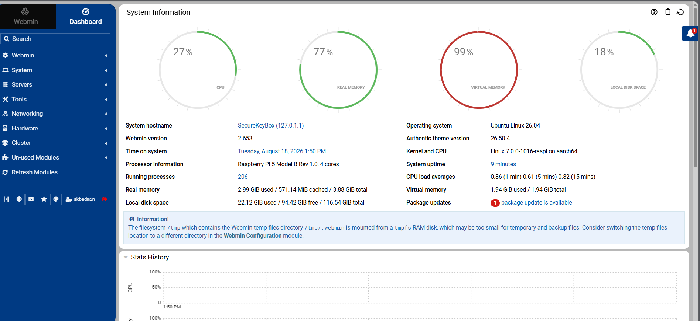

Webmin provides a separate host administration view alongside the SOC dashboard. The supplied capture identifies a Raspberry Pi 5 running Ubuntu Linux and shows CPU, physical and virtual memory, disk usage, uptime, running processes, and package updates. Operators use this view to diagnose resource pressure and inspect the underlying host; security-event investigation remains in the product dashboard. The snapshot shows high virtual-memory usage, which deserves investigation but does not by itself establish a service failure.

## Network security and vulnerability assessment

### Firewall enforcement

The firewall engine applies the validated security policy at the network edge. It receives interface zones, operator-approved rules, and block decisions from the backend, then returns rule state, allowed/refused flow information, and auditable change events.

### Detection and traffic analysis

Detection and traffic analysis transform network activity into alerts, protocol metadata, flow history, and investigation context. This layer feeds the correlation engine so the dashboard can show what happened, where it happened, and which asset is affected.

### Suricata alert example

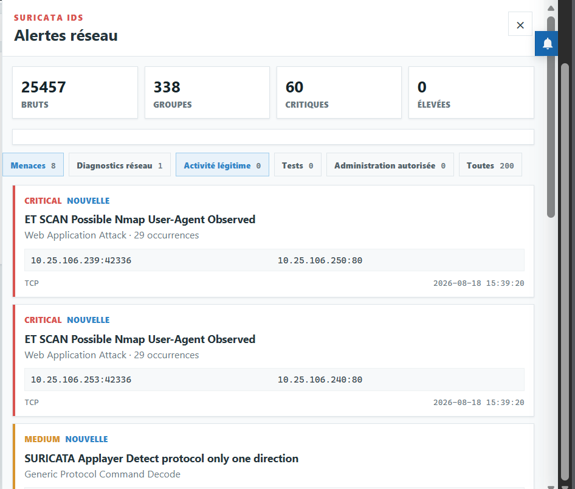

The screenshot shows Suricata alerts generated during the report's controlled Nmap test. Grouped entries expose the signature, severity, source and destination endpoints, protocol, occurrence count, and timestamp. This view gives the operator evidence to investigate before deciding on a block. An alert indicates detection; enforcement must be checked separately through firewall state and a follow-up connectivity test.

### Vulnerability assessment

The vulnerability layer connects known assets and detected services with security findings. Its role is not only to list weaknesses, but to prioritize them according to exposure, affected service, and operational importance.

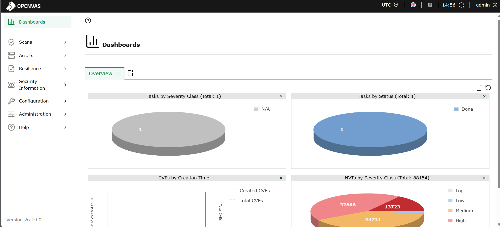

The OpenVAS view complements the product's consolidated vulnerability display. It exposes scan tasks, task completion, assets, security information, and the vulnerability-test feed. In this snapshot, one task is marked done and the NVT chart represents the available test catalogue, not a count of vulnerabilities detected on the network. Findings from completed scans are associated with equipment and prioritized by the backend.

## Backend and operator interface

### Backend API

The backend API is the coordination point of the product. It normalizes data, stores structured records, prepares dashboard views, manages operator workflows, and sends validated actions toward security services.

### Platform settings

The platform settings also control presentation preferences such as interface language, table density, theme, and date format, so exported views remain consistent with operational needs.

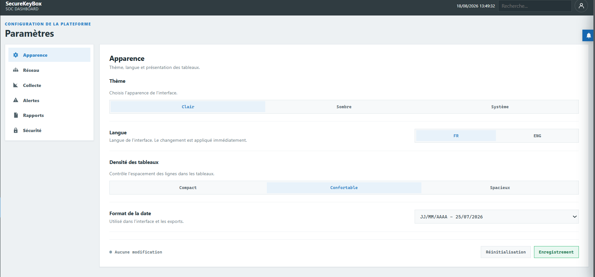

The settings view exposes light, dark, and system themes; French and English language selection; table density; and date formatting. Separate navigation entries organize network, collection, alerts, reports, and security settings. Save and reset controls manage pending presentation changes.

## Product dashboard views

The interface gives operators a direct view of the appliance state, detected equipment, active services, incidents, and audit indicators. The following original prototype screenshots retain their French interface labels. Values and host addresses show the captured test environment.

### Operational dashboard

The overview combines active equipment, blocked addresses, ledger integrity, critical vulnerabilities, and incidents awaiting analysis. Risk-ranked hosts and ledger activity charts help prioritize investigation. CPU, memory, network throughput, and service status show whether the appliance is healthy.

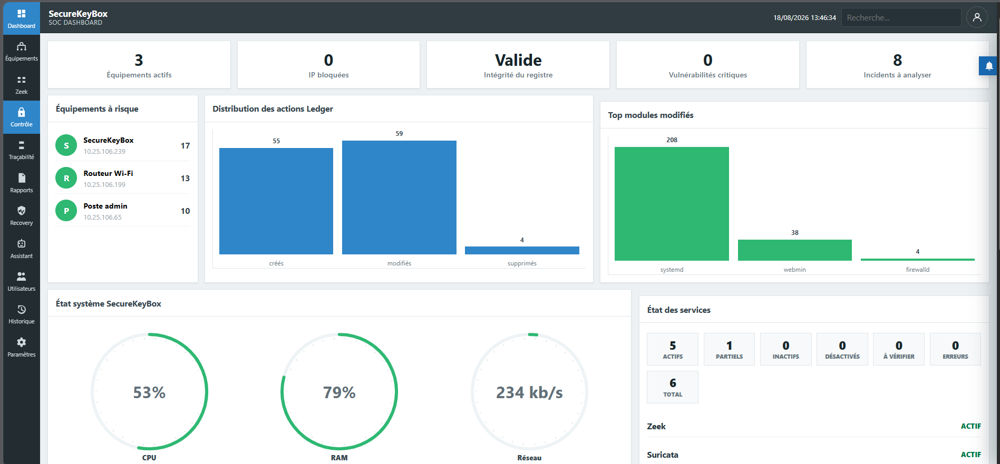

### Detected equipment

The inventory distinguishes active, known, authorized, monitored, blocked, and offline equipment. Each card combines identity, address, device category, risk score, observed traffic, protocols, and alert or vulnerability counters. Search and status filters help operators select the host to investigate.

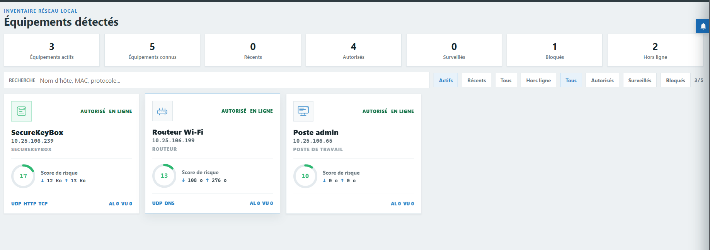

## Data and evidence model

The architecture separates raw logs, normalized events, operator actions, and signed evidence. This separation makes the platform easier to audit and safer to operate.

### Main data families

| Data family | Examples | Treatment |
| --- | --- | --- |
| Network events | Connections, DNS activity, protocol metadata, IDS alerts. | Normalized, indexed, linked to assets. |
| Security decisions | Blocked traffic, accepted rules, validated exceptions. | Recorded with timestamp, source, and operator context. |
| Asset information | Hostnames, services, observed ports, device categories. | Updated over time and used to contextualize risks. |
| Vulnerability findings | CVE references, severity, affected service, remediation status. | Prioritized and connected to assets. |
| Audit records | Configuration changes, sensitive actions, register updates. | Hashed, chained, signed, and verifiable. |

## Log integrity and auditability

### Ledger and signature architecture

The signed ledger receives sensitive events, creates a hash, links each record to the previous one, and stores a verifiable proof. If someone modifies an old record, the chain no longer validates.

The log strategy has two goals: keep the system lightweight and preserve proof. The appliance should reduce disk usage without destroying the chain of evidence.

### Integrity workflow

1. Security events and sensitive actions are normalized.
2. Each important record receives a cryptographic hash.
3. Records are chained with the previous hash.
4. The chain is signed by the appliance.
5. Verification checks the signature, hashes, and chain continuity.
6. Any later modification breaks the chain and raises an integrity alert.

### Log lifecycle

| Step | Goal |
| --- | --- |
| Collection | Gather events from network, security, system, and application services. |
| Rotation | Split active logs into controlled periods. |
| Compression | Reduce storage pressure without losing traceability. |
| Retention | Keep useful history according to operational policy. |
| Signed ledger | Preserve a tamper-evident trace of important events. |

### Integrity dashboard

The integrity view displays chain validity, event count, recent changes, last verification, signature status, and current sequence. Filters narrow the audit trail by period, component, action, integrity, importance, actor, or address. The grouped timeline links recorded changes to their verification status.

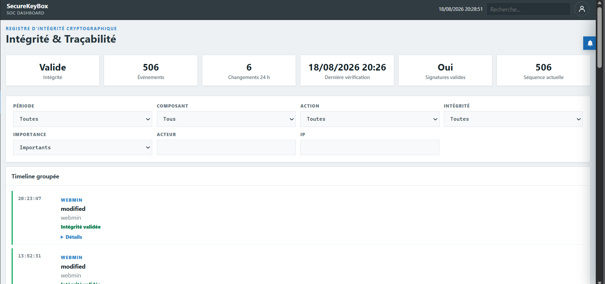

### Signed event example

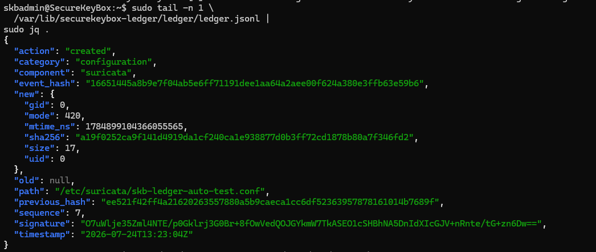

The captured JSON record documents a Suricata configuration-file creation. It contains the action, category, component, file metadata, event hash, previous hash, sequence number, signature, and timestamp. These fields connect an individual change to the audit chain. Hash continuity and signature validation are separate checks; the presence of a signature in a record alone does not demonstrate successful verification.

## Signed reports and exports

SecureKeyBox includes a reporting layer for operational follow-up, security review, incident reconstruction, and audit evidence. Reports are generated from normalized events and can be tied back to the signed ledger so the operator can show when a report was produced, what it contained, and whether the associated evidence chain still validates.

### Report types

| Report type | Purpose | Typical content |
| --- | --- | --- |
| Executive report | Gives management a readable security summary. | Network summary, number of assets, main alerts, high risks, critical vulnerabilities, recommended actions. |
| Equipment report | Documents one host or device in detail. | Identity, traffic, protocols, alerts, vulnerabilities, and blocking history for a selected asset. |
| Incident report | Reconstructs a security event. | Timeline, source and destination IPs, Suricata alerts, Zeek events, actions taken, and integrity proof. |
| Integrity report | Proves the state of the evidence chain. | Number of changes, modified files, signatures, chain state, last hash, and verification result. |

### Export formats

| Format | Use |
| --- | --- |
| PDF | Human-readable signed report for audits, management reviews, and incident documentation. |
| CSV | Lightweight export for SIEM import, spreadsheet filtering, or automated processing. |
| Excel | Structured workbook for operational review, sorting, filtering, and sharing with non-technical teams. |

### Generated equipment report

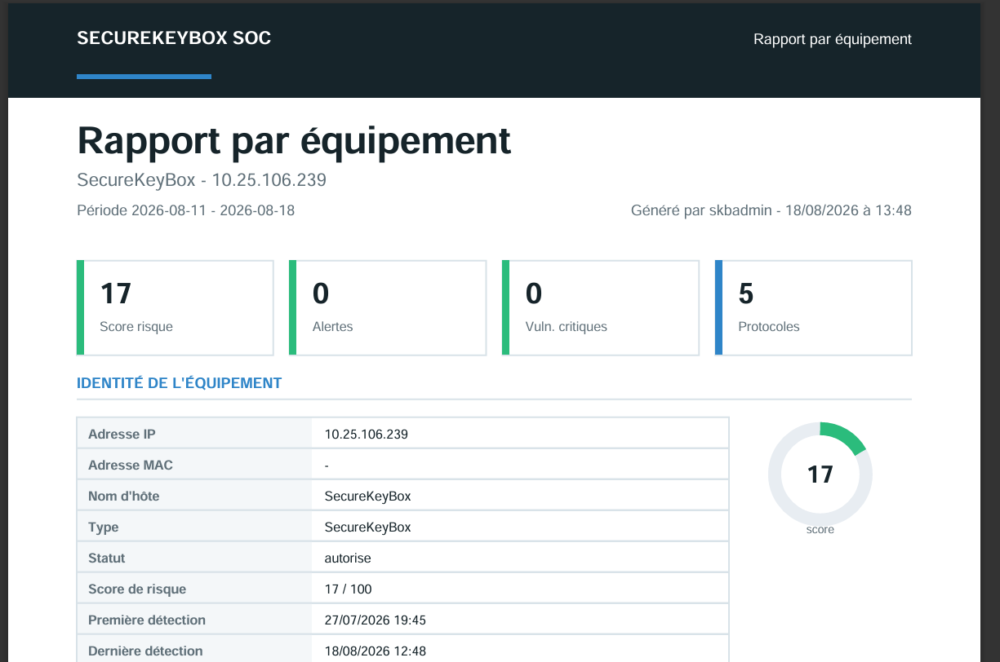

This exported report presents a selected host over a defined reporting period. Its first page combines identity, authorization status, a risk score, alert and critical-vulnerability counts, and observed protocols. Generation metadata records the operator and time. It shows the actual document produced by the reporting workflow rather than only the report-generation interface. The displayed counters are a snapshot and should be interpreted within the report's period and data scope.

## Resilience mode

SecureKeyBox includes a degraded-mode logic for situations where a service becomes unavailable, the system detects an anomaly, or the appliance must keep a minimal defensive posture while recovering.

The resilience cycle follows six stages:

| Stage | Role |
| --- | --- |
| Monitoring | Monitor service health, network state, resource pressure, and appliance behavior. |
| Anomaly detection | Identify outage, overload, failed service, suspicious condition, or attack symptom. |
| Mode decision | Decide whether the appliance remains normal, switches to degraded mode, or enters a safe mode. |
| Minimal protection | Keep essential filtering and local protection active even when advanced services are degraded. |
| Recovery | Restart, resynchronize, or restore affected services in a controlled way. |
| Return to normal | Validate restored services and resume standard operation with updated evidence. |

### Recovery dashboard

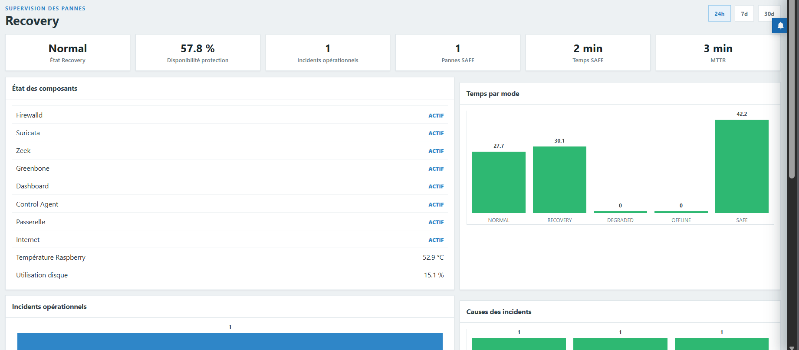

The operational view complements the resilience cycle with component status, current mode, protection availability, incident counts, time spent in SAFE mode, and mean time to recovery (MTTR). It also displays appliance temperature, disk use, and time distribution across NORMAL, RECOVERY, DEGRADED, OFFLINE, and SAFE states. The figures describe the captured observation window, not a production availability commitment.

## Startup and diagnostics

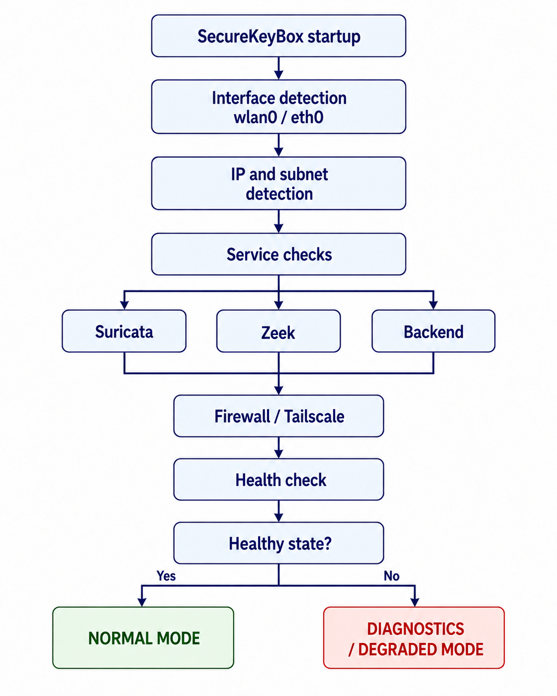

The startup flow detects the network interface and its IP/subnet, checks Suricata, Zeek, and the backend, then checks Firewall/Tailscale and overall health. A healthy result leads to normal mode; a failed result leads to diagnostics or degraded operation. The diagram preserves the report's flow and technology labels, with its French text translated into English.

## CI/CD pipeline

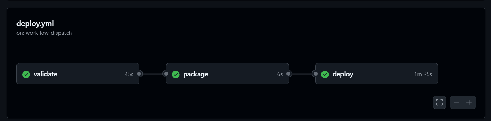

The supplied GitHub Actions run shows three successful jobs: **validate**, **package**, and **deploy**, triggered through **workflow_dispatch**. Their displayed durations are 45 seconds, 6 seconds, and 1 minute 25 seconds. This screenshot demonstrates completion of that pipeline run; it does not expose the workflow implementation or establish which checks were executed inside each job.

## Assistant and knowledge layer

The assistant is not a replacement for the operator. It is a support layer that helps interpret alerts, explain logs, summarize reports, and propose diagnostic steps from approved project knowledge.

### Assistant capabilities

| Capability | Description |
| --- | --- |
| Natural questions | The operator asks questions in plain language. |
| Context retrieval | The assistant uses indexed documentation, reports, logs, and known procedures. |
| Alert explanation | Events are translated into understandable risk context. |
| Action guidance | The assistant proposes next steps, checks, and remediation paths. |
| Human validation | Sensitive actions remain under operator control. |

### Retrieval architecture

The assistant retrieves approved project context before producing an answer. It can explain alerts, summarize reports, and propose diagnostic steps, but it does not silently apply critical changes.

### Report analysis in the assistant

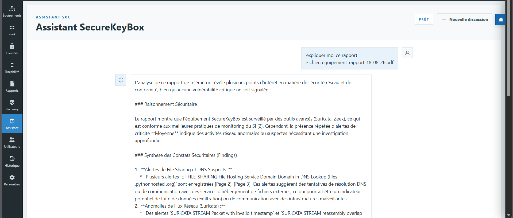

The operator attaches an equipment PDF and asks for an explanation. The assistant summarizes observations, discusses Suricata and Zeek context, and cites pages or reference material. The screenshot demonstrates the document-analysis workflow; generated interpretations still need to be checked against the underlying evidence. For example, a file-hosting-domain alert by itself does not establish exfiltration or malicious intent.

## RAG evaluation results

These figures document the supplied prototype evaluation. They describe the captured results, not guaranteed performance for every deployment. The attachments do not specify the sample size, query set, relevance-labeling procedure, hardware used for inference, or number of repeated measurements.

### Retrieval recall

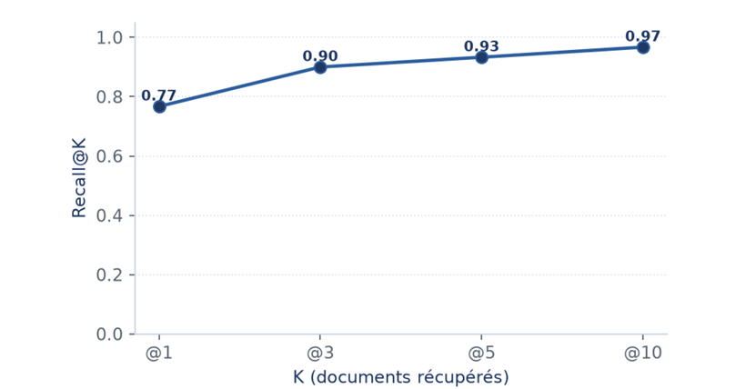

Recall@K measures the fraction of relevant documents found among the first K retrieved results. Recall rises from **0.77 at K=1** to **0.90 at K=3**, **0.93 at K=5**, and **0.97 at K=10**. Retrieving more documents improves coverage in this evaluation, with smaller gains after the first three results.

### Retrieval precision

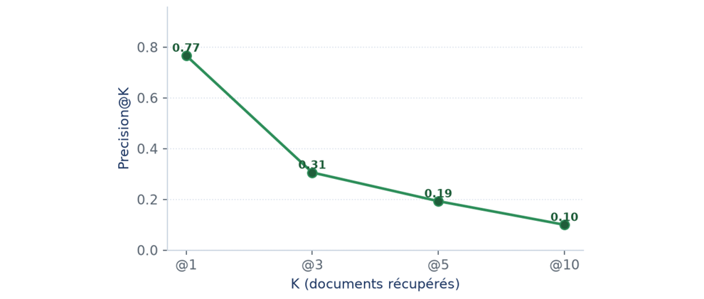

Precision@K measures the fraction of retrieved documents judged relevant. It falls from **0.77 at K=1** to **0.31 at K=3**, **0.19 at K=5**, and **0.10 at K=10**. Wider retrieval therefore adds context but also adds irrelevant material. Recall and precision should be considered together when choosing K, filtering evidence, or adding a reranking stage.

| K | Recall@K | Precision@K |
| --- | --- | --- |
| 1 | 0.77 | 0.77 |
| 3 | 0.90 | 0.31 |
| 5 | 0.93 | 0.19 |
| 10 | 0.97 | 0.10 |

### Retrieved-document similarity

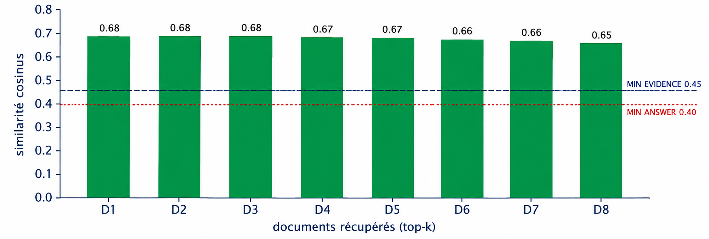

The eight displayed documents score between **0.65 and 0.68** in cosine similarity. All exceed the shown evidence threshold of **0.45** and answer threshold of **0.40**. These thresholds can gate evidence selection and answer generation, but similarity alone does not prove factual correctness or document relevance.

### Response-score distribution

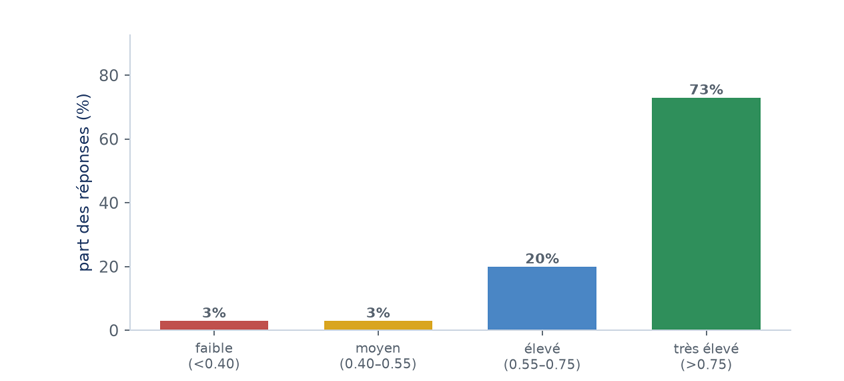

The supplied distribution assigns **3%** of responses to the low band (below 0.40), **3%** to medium (0.40-0.55), **20%** to high (0.55-0.75), and **73%** to very high (above 0.75). The displayed rounded percentages sum to 99%. The score definition is not included in the attachment, so these bands should not be interpreted as measured answer accuracy.

### Pipeline latency

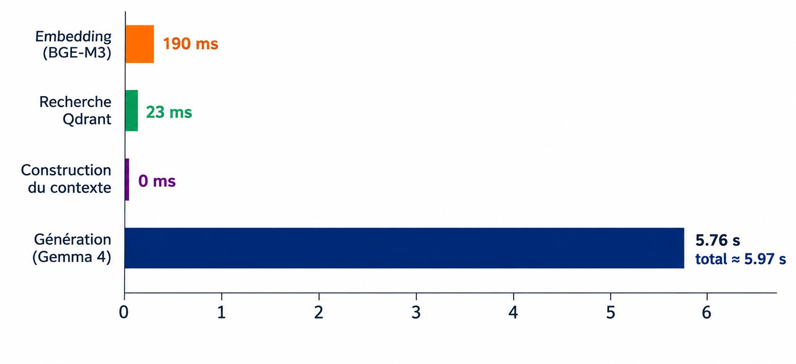

The captured pipeline takes approximately **5.97 seconds**: **190 ms** for BGE-M3 embedding, **23 ms** for Qdrant retrieval, context construction displayed as **0 ms**, and **5.76 seconds** for Gemma 4 generation. The displayed zero may reflect measurement resolution rather than literally no work. Generation accounts for roughly **96%** of the displayed total and dominates response time.

The pipeline connects the question encoder to vector retrieval, assembles selected evidence into context, and passes that context to the generation model. Retrieval scores support evidence selection; generated answers still require grounded citations and operator review for sensitive decisions.

## Security boundaries

This repository intentionally avoids publishing operational details that would weaken a real deployment.

Published:

- Product-level architecture
- Public module descriptions
- High-level data flows
- Public validation logic
- Documentation license

Not published:

- Secrets, keys, tokens, or credentials
- Real customer data
- Production network configuration
- Production firewall rules
- Internal deployment scripts
- Exploit procedures or offensive playbooks

## License

This documentation, diagrams, structure, and written content are protected by the license included in [LICENSE](LICENSE). Public visibility does not grant permission to copy, reuse, resell, rebrand, or redistribute the project content.
